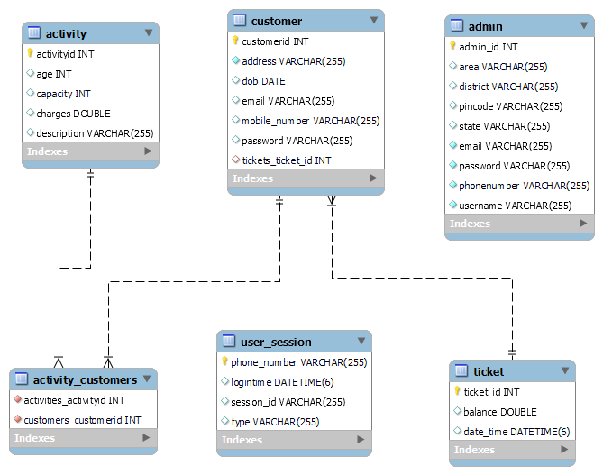

# **ThrillCity** - Amusement Park Backend Application

* This is a backend application built using Spring Boot to handle the backend logic for an amusement park website. The application provides various endpoints for managing the park, rides, and visitors.


<br>

# Getting Started

* To get started with the application, you need to have Java 8 and Maven installed on your system. Once you have these dependencies installed, you can follow the steps below to run the application:

    1. Clone the repository to your local system

    2. Navigate to the root directory of the project

    3. Run the following command to start the application:
 
    ```
    mvn spring-boot:run 
    ```
    4. Once the application is up and running, you can access the Swagger documentation at <span> [Visit the Swagger UI](http://localhost:8080/swagger-ui.html)</span> to explore the available endpoints and their functionalities.

<br>


# Entity Relationship Diagram




# Endpoints
The application provides the following endpoints for managing the amusement park:

- Base Url: **http://localhost:8080**

- **GET /activities** : Get a list of all activities in the amusement park.

- **GET /activities/{id}** : Get a ride by its ID.

- **POST /abc**: Create a new activity.

- **PUT /rides/{id}** : Update an activity by its ID.

- **DELETE /activities/{id}** : Delete an activity by its ID.

- **GET /customers**: Get a list of all customers.

- **GET /customers/{id}**: Get a customer by their ID.

- **POST /customers** : Create a new customer.

- **PUT /customers/{id}**: Update a customer by their ID.

- **DELETE /users/{id}**: Delete a customer by their ID.

<br>


# Swagger Documentation
* The Swagger documentation for the application can be accessed at http://localhost:8080/swagger-ui.html. This documentation provides a user-friendly interface to explore the available endpoints and their functionalities. You can use this documentation to test the various endpoints and understand how the application works.
<br>
# Technologies Used
- The application was built using the following technologies:

    1. Spring Boot
    2. Swagger
    3. Maven

# Conclusion
This is a simple backend application built using Spring Boot and Swagger to handle the backend logic for an amusement park website. The application provides various endpoints for managing the park, rides, and visitors. The Swagger documentation makes it easy to explore the available endpoints and understand how the application works.
